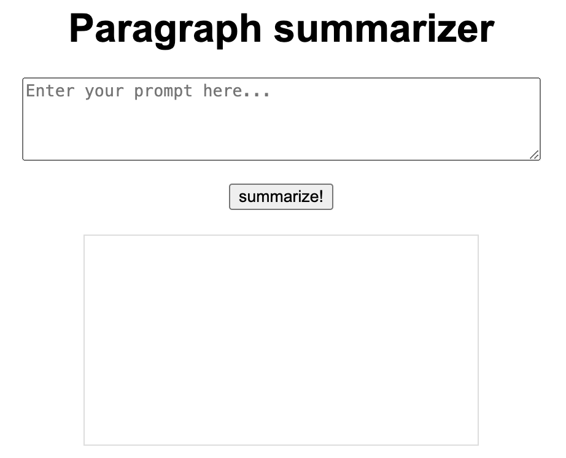

# IDS706-individual-project4 

## Individual Project #4: Auto Scaling Flask App Using Any Serverless Platform
### Requirements
For this assignment, you will build a publicly accessible auto-scaling container using Azure App Services and Flask. This is an easy way to build and deploy a scaleable web-hosted app and will allow you to apply your Flask knowledge from previous lessons.

### Your project will be graded on the following criteria:
- A README.md file (15 points): This should clearly explain what the project does, its dependencies, how to run the program, and conclude with actionable and data-driven recommendations to a hypothetical management team.
    - Clarity and completeness of README: 10 points
    - Quality of conclusion and recommendation: 5 points
- GitHub Repo (20 points): A complete GitHub Repo that contains all required scripts and documentation to run your application.
- Flask App (20 points):
    - Functionality within Docker/(Platform): 10 points
    - Creativity/sophistication, full credit (all 20 points for this section) will be given to students who have a functioning embedded LLM within Flask: 10 points.
- Use of DockerHub (Or equivalent) (10 points): Hosting your functioning container on DockerHub.   
- Azure Web App (Or equivalent) (15 points): Successfully deploying your container via Azure Web App to a public endpoint. This can be done either directly from Docker or through Azure container registry.
- Video Demo (20 points): A YouTube link in README.md showing a clear, concise (2-5min) walkthrough and demonstration of your application. The video should be high-quality (both audio and visual), not exceed the given time limit, and be linked in the README via a private or public YouTube link.
    - Clarity of explanation: 8 points
    - Quality demonstration of the project: 7 points
    - Quality of video and audio: 5 points
- Total: 100 points

[Demo Website](https://ids706-individual-project4.azurewebsites.net/)

### Step One Environment Set Up
Set up the environment using GitHub Code Spaces and VScode.

### Step Two Flask App
Build an embedded LLM flask app. 

### Step Three Build Docker File
Be sure to expose the port 5000 Commands:

docker build individual-project4 .
docker run -p 5000:5000 individual-project4

### Step Four Login to DockerHub via Codespaces
docker login --username=XXXX in the terminal, build container and push it to DockerHub Commands:
'''bash
docker login --username=
docker build -t username/individual-project4 .
docker push username/individual-project4
'''

### Step Five
Set up via Azure App Services, it's key in the configuration setting to add "WEBSITES_PORT" with a value of 5000 (more below)

Log into Azure, search app services and select create (web app)

When creating the app be sure to select Docker Container

When selecting the Docker container be sure to point to the correct image tab

After deployment you'll need to go configuration and add "WEBSITES_PORT" with a value of 5000. 
This will allow your app to run on at the public URL provided by Azure

### Description
This project is an embedded LLM Flask-based web application containerized using Docker. 

### Dependencies
- Python 3.x
- Flask
- Docker

### Conclusion and Recommendations
The current project successfully utilizes Azure App Services for auto-scaling. To further enhance this, we recommend implementing performance monitoring tools to track the app's responsiveness and load times. This will help identify any bottlenecks and optimize resources, ensuring the app scales efficiently under varying loads.

[Demo Video Link](https://youtu.be/YNDkSy3NCzk)